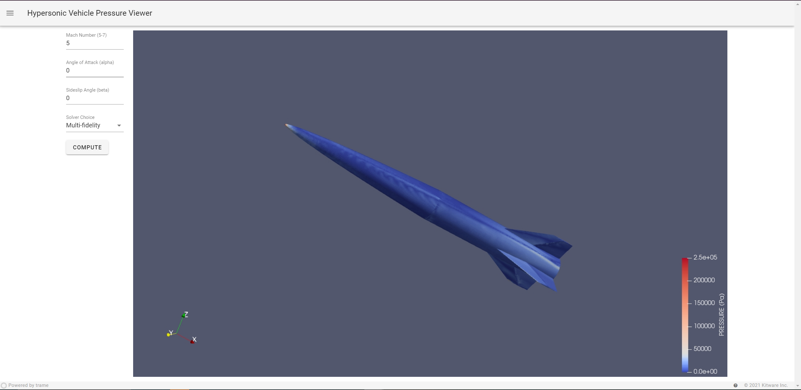

# Multifidelity Linear Regression Demo 2
This repository contains the code for the MFLR_Demo2 web application. The app is a demonstration of the multi-fidelity linear regression methods presented in this [work](https://arc.aiaa.org/doi/abs/10.2514/6.2023-0916). Due to the fast inference capability of the underlying linear regression based methodologies, we can enable live visualizations of the surface pressure field upon a hypersonic vehicle. When a user changes the parameters, the surface pressure field is updated live, and the rendering reflects the changes. One can change between the multi-fidelity (multi-step) and single-fidelity methods to see the differences based on flight conditions.

## MFLR_Demo2 Web App Setup Guide

This guide provides instructions to set up and run the **MFLR_Demo2** web application locally. The app utilizes a Flask backend and a Trame-based frontend, requiring two virtual environments. The backend serves the frontend and provides the ParaView server with the necessary data to render the visualizations. The frontend allows users to interact with the visualizations. 

## Prerequisites

1. **ParaView Installation**:
   - Download and install [ParaView 5.12.0 or higher](https://www.paraview.org/download/).

2. **Python Virtual Environment Installation**:
   - Ensure Python 3.8+ is installed. If not, download from [Python's official website](https://www.python.org/downloads/).

## Setup Instructions

### 1. Clone the Repository

Clone this repository to your local machine:
```bash
git clone https://github.com/VigneshSella/MFLR_Demo2
cd MFLR_Demo2
```

### 2. Create Virtual Environments
```bash
python -m venv .venv
python -m venv .flaskvenv
```

### 3. Install the respective dependencies
For the flask server:
```bash
source .flaskvenv/bin/activate
pip install -r backend_reqs.txt
```
For the trame frontend:
```bash
source .venv/bin/activate
pip install -r requirements.txt
```
NOTE: If on Windows, replace `source` and `/` with `.\` and `\` in the above commands.

### 4. Run the Web App
Open a terminal and run:
```bash
source .flaskvenv/bin/activate
python app.py
```
Leave the first terminal open and open a new terminal to run:
```bash
source .venv/bin/activate
"C:\Program Files\ParaView 5.12.0\bin\pvpython.exe" main.py --venv .venv
```
NOTE: On MacOS, replace `"C:\Program Files\ParaView 5.12.0\bin\pvpython.exe"` with the path to the `pvpython` executable.

One can also easily make a shell or bash script to run the above commands.


## Example Image

